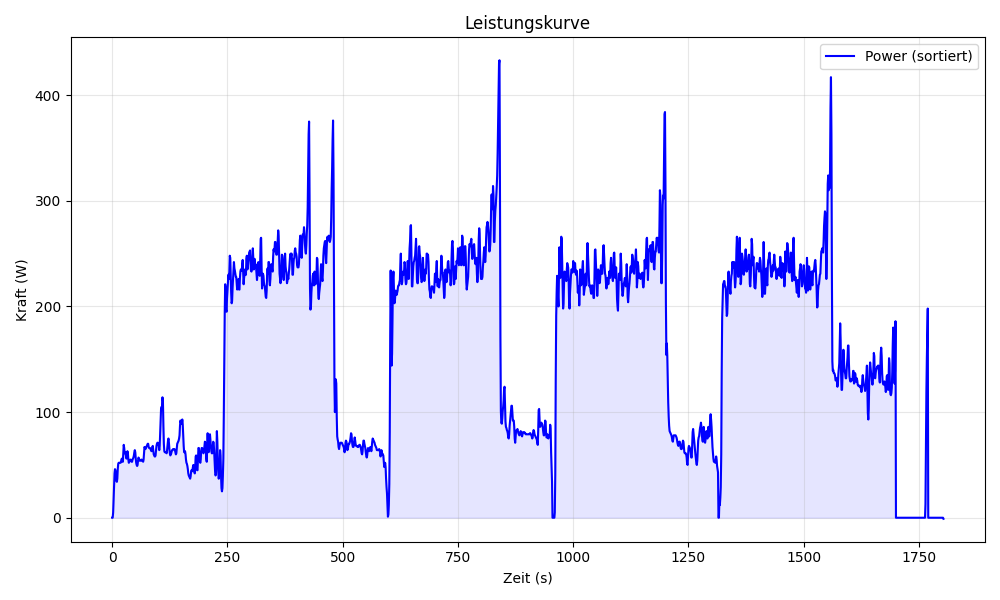

# Leistungskurve



Dieses Projekt analysiert und visualisiert Leistungskurven aus Aktivitätsdaten. Die Rohdaten werden sortiert und als Grafik dargestellt.

## Funktionen

- **Daten laden**: Liest Aktivitätsdaten aus CSV-Dateien
- **Sortierung**: Implementiert Bubble Sort zum Sortieren von Leistungswerten
- **Visualisierung**: Erstellt eine Power-Curve-Grafik mit Matplotlib
- **Datenanalyse**: Behandelt große Datenmengen effizient

## Projektstruktur

```
Leistungskurve_Richtig/
├── src/
│   ├── load_data.py          # Daten aus CSV laden
│   ├── sort.py               # Bubble Sort Implementierung
│   └── power_curve.py        # Grafik-Erzeugung
├── data/
│   └── activity.csv          # Aktivitätsdaten (Eingabe)
├── images/
│   └── Figure_1.png          # Beispiel-Ausgabegrafik
├── requirements.txt          # Python-Abhängigkeiten
├── README.md                 # Dokumentation (diese Datei)
└── .gitignore               # Git-Ignorierungsdatei
```

## Installation

### Abhängigkeiten

```bash
pip install -r requirements.txt
```

### Verwendung

```bash
python src/power_curve.py
```

Das Skript lädt die Daten aus `data/activity.csv`, sortiert die Leistungswerte und erstellt eine Grafik.

## Abhängigkeiten

- numpy
- matplotlib

## Autoren

Antonio Mrkonja 
Lenn Oswald
Noah Reinermann

